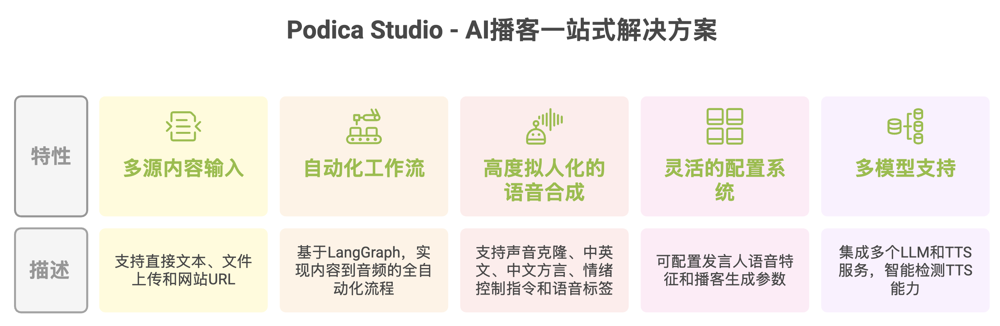
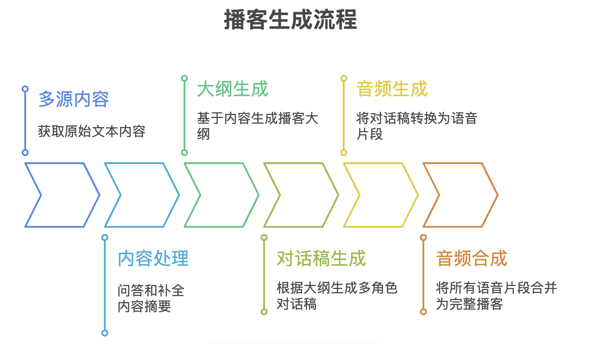
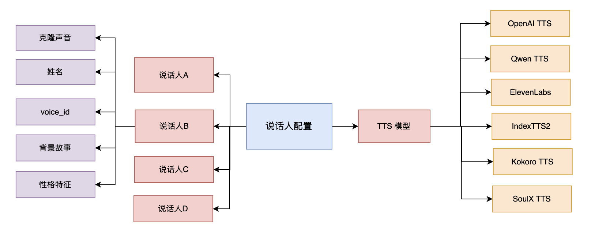
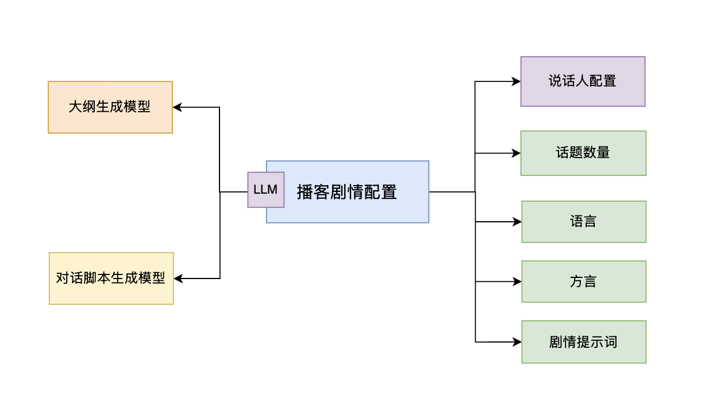

# AI播客 - Podica Studio

## 项目概述

Podica Studio 是一个基于AI驱动播客创作一站式解决方案，能够将各种文本内容转化为多角色对话形式的播客音频。系统利用大型语言模型（LLM）进行内容分析、结构化和对话生成，并通过文本转语音（TTS）技术将文本转换为自然流畅的语音对话。

## 特色功能

- **多源内容输入**：支持多种内容来源灵活适配不同场景的内容需求。
  - **直接文本输入**
  - **文件上传** 支持PDF、DOCX、TXT等
  - **网站URL** 自动提取URL内容

- **自动化工作流**：基于LangGraph工作流引擎，实现从内容输入到音频输出的全自动化流程，包括内容转换、大纲生成、对话稿生成、音频生成和音频合成等步骤。
  - **完整的播客结构**：生成的音频符合播客的基本要求，包含开场、主题、结尾。
  - **智能内容处理**：自动进行内容问答补全和摘要生成，确保输入内容的质量和完整性，为播客生成提供优质素材。
  - **智能大纲生成**：基于输入内容和用户指令，自动生成结构化的播客大纲，包含多个段落（segments），每个段落具有明确的主题和描述。
  - **多角色对话生成**：支持1-4个发言人同时参与对话，每个发言人具有独特的背景故事、个性特征和说话风格，营造真实的多人对话氛围。


- **高度拟人化的语音合成**：音色、语音语调高度拟人化, 避免机械生硬或平淡无情绪的表达。
  - **声音克隆** 
  - **中文方言支持**：支持多种中文方言生成，包括粤语、四川话、河南话、上海话等
  - **情绪控制** 支持对话情绪控制指令
  - **语音标签（Voice Tags）支持**：支持在对话中嵌入语音标签（如[laughter]、[sigh]、[breathing]等），增强对话的自然度和真实感，使生成的播客更加生动。


- **灵活的配置系统**：
  - **Speakers Profile**：可配置发言人语音特征，包括TTS服务提供商、语音ID、背景故事、个性特征等
  - **Episode Profile**：可配置播客生成参数，包括使用的Speakers Profile、LLM模型、段落数量、语言、方言、自定义指令等

- **多模型支持**：用户可根据需求灵活选择。
  - **集成多个LLM模型**  腾讯混元、OpenAI, Qwen, DeepSeek等
  - **集成多个TTS服务** Eleven Labs、OpenAI TTS、Qwen TTS、Kokoro TTS、IndexTTS2、SoulX TTS、V3API、LaoZhang），
  - **TTS Capability**：智能检测TTS提供商的能力，包括支持的语言、方言、语音标签、声音克隆等，自动适配可用功能。

## 项目预期效果

**经济效益：**
1. **成本降低**：传统播客制作需要专业团队（主持人、编辑、后期），成本高昂。本系统可将制作成本降低80%以上，单期播客制作时间从数天缩短至几分钟。
2. **效率提升**：自动化流程大幅提升内容生产效率，支持批量生成，满足规模化内容需求。
3. **商业模式创新**：为内容平台、教育机构、企业提供新的内容变现渠道，创造新的商业价值。

**社会效益：**
1. **内容民主化**：降低播客制作门槛，让更多创作者能够参与音频内容创作，丰富内容生态。
2. **文化传承**：支持多语言、多角色对话，有助于文化内容的多样化表达和传播。




## 整体架构

系统由以下主要组件构成：

1. **多源内容上传**：支持从文件、网站和直接文本输入等多种渠道获取内容。

2. **智能播客生成器**：核心组件，负责内容分析、结构化、剧本生成和多角色语音合成。

3. **播客模板系统**：提供可定制的模板，包括播客名称、内容指令、角色设定、语音风格等。

4. **模型管理系统**：集成多种LLM和TTS提供商，包括腾讯混元、Qwen、DeepSeek等LLM， 以及OpenAI TTS、Eleven Labs、Kokoro TTS、IndexTTS2、 Soulx TTS等模型。

技术栈

- **后端框架**：Python基础库 + streamlit
- **LLM集成**：腾讯混元、Qwen、DeekSeek、Erine、OpenAI等
- **TTS服务**：ElevenLabs、OpenAI TTS、Kokoro TTS、Qwen TTS、IndexTTS2、SoulX TTS等
- **工作流引擎**：LangGraph
- **模板系统**：Jinja2

## 部署说明

### 手动安装和启动 Podica Studio 

*** conda 安装环境 ***

```
conda create --name=podcast python=3.12
conda activate podcast
pip install -i https://pypi.tuna.tsinghua.edu.cn/simple -r src/requirements.txt
```
*** 配置 .env ***

```
cp src/server/.env.exmaple src/server/.env
修改和配置 .env 环境变量
```

*** streamlit 启动 Podica Stuido ***

```
streamlit run src/server/app.py
```


### docker 部署

构建配置：
阿里云： ecs.c9i.2xlarge 
CPU: 8 vCPU  Intel(R) Xeon(R) 6982P-C 
内存：16 GiB 


***docker-compose.yaml***,  在 docs/docker 目录下 
```
services:
  kokoro:
    image: registry.cn-hangzhou.aliyuncs.com/2456868764/kokoro-tts:1.0.1
    ports:
      - "9000:9000"
    pull_policy: always
  podcast-studio:
    image: registry.cn-hangzhou.aliyuncs.com/2456868764/podcast-studio:1.0.2
    ports:
      - "8501:8501"
    environment:
        - ERNIE_API_KEY=bce-XXX
        - KOKORO_BASE_URL=http://kokoro:9000/v1
        - V3API_BASE_URL=https://api.gpt.ge/v1/
        - V3API_API_KEY=sk-xxx
    depends_on:
      - kokoro
    pull_policy: always
networks:
  default:
    driver: bridge
```

***配置***

在 docker-compose.yaml 中配置环境变量，包括：

- KOKORO_BASE_URL ：Kokoro TTS服务URL，默认值为 http://kokoro:9000/v1, 使用 `hexgrad/Kokoro-82M-v1.1-zh` 模型提供TTS服务，用于测试。
- ERNIE_API_KEY ：文心一言API密钥
- V3API_API_KEY ：v3api API密钥（用于 OpenAI TTS 服务），访问 `https://api.v3.cm/` 进行注册、获取API密钥。

***启动***

```bash
docker compose up -d
```

**访问**

- Podica Studio 管理入口：http://localhost:8501 就进入 Podica Studio 管理界面, 用于配置播客模板、上传内容、生成播客。

- Podica Studio 介绍使用视频
  [Podica Studio 介绍使用视频](./docs/voices/podica.mp4)


### 开源 TTS 模型部署

** TTS 模型构建的GPU配置如下**:
- 镜像 PyTorch  2.8.0
- Python  3.12(ubuntu22.04)
- CUDA  12.8
- GPU: RTX 4090(24GB) * 1
- CPU: 16 vCPU Intel(R) Xeon(R) Gold 6430
- 内存:120GB
- 硬盘: 系统盘:30 GB
- 数据盘: 100GB SSD


在 src/llm 目录下：

** Kokoro TTS **
```
# download model
huggingface-cli download --resume-download hexgrad/Kokoro-82M-v1.1-zh  --local-dir ./models/hexgrad/Kokoro-82M-v1.1-zh
# install python 
conda create --name=kokoro python=3.12
conda activate kokoro
pip install -i https://pypi.tuna.tsinghua.edu.cn/simple -r requirements_kokoro.txt
# startup
TTS_PROVIDER=kokoro python service.py
```

** Index TTS 模型**
```
# download model
huggingface-cli download --resume-download IndexTeam/IndexTTS-2  --local-dir ./checkpoints/IndexTeam/IndexTTS-2
# install python 
conda create --name=indextts python=3.12
conda activate indextts
pip install -i https://pypi.tuna.tsinghua.edu.cn/simple -r requirements_indextts.txt
# startup
TTS_PROVIDER=index-tts python service.py
```

** Soulx TTS 模型**
```
# download model
huggingface-cli download --resume-download Soul-AILab/SoulX-Podcast-1.7B-dialect --local-dir ./pretrained_models/SoulX-Podcast-1.7B-dialect
# install python 
conda create --name=soulx python=3.12
conda activate soulx
pip install -i https://pypi.tuna.tsinghua.edu.cn/simple -r requirements_soulx.txt
# startup
TTS_PROVIDER=soulx python service.py
```


# 核心流程

## 工作流引擎驱动

播客生成的核心流程由LangGraph工作流引擎驱动，包含以下步骤：
1. **多源内容** 获取原始文本内容
   - 支持文件上传（PDF、DOCX、TXT等）
   - 支持网站URL提取
   - 支持直接文本输入
2.  **内容处理**：对输入内容进行初步分析和处理   
   - 内容问答和补全
   - 内容摘要
3. **大纲生成**：基于内容生成播客大纲，包含多个段落
   - 用户指令 
   - Episode Profile 配置 
   - LLM 模型配置
4. **对话稿生成**：根据大纲生成多角色对话稿
   - 大纲
   - Episode Profile 配置 
   - LLM 模型配置
5. **音频生成**：将对话稿转换为语音片段
   - SpeakerProfile 配置 
   - TTS 服务配置
6. **音频合成**：将所有语音片段合并为完整播客





工作流定义如下：

```python
# 定义工作流图
workflow = StateGraph(PodcastState)

# 添加节点
workflow.add_node("content_transform", content_transform_node)
workflow.add_node("generate_outline", generate_outline_node)
workflow.add_node("generate_transcript", generate_transcript_node)
workflow.add_node("generate_all_audio", generate_all_audio_node)
workflow.add_node("combine_audio", combine_audio_node)

# 定义边
workflow.add_edge(START, "content_transform")
workflow.add_edge("content_transform", "generate_outline")
workflow.add_edge("generate_outline", "generate_transcript")
workflow.add_conditional_edges(
  "generate_transcript", route_audio_generation, ["generate_all_audio"]
)
workflow.add_edge("generate_all_audio", "combine_audio")
workflow.add_edge("combine_audio", END)

graph = workflow.compile()
```

## Speakers Profile

Speakers Profile 定义了每个发言人的语音特征，包括语音ID、背景故事、个性特征等。
  - name: profile name
  - tts_provider: TTS 服务提供商，例如 elevenlabs, qwen, openai, kokoro, indexTTS2 等
  - tts_model: TTS 模型名称，根据 tts_provider 不同而变化, 例如 tts-1
  - speakers: 发言人列表，可以包含1-4个发言人，每个发言人包含以下字段
    - name: 发言人名称
    - voice_id: 语音ID，用于标识不同的语音模型或服务提供商的语音。
    - backstory: 背景故事，描述发言人的背景、经历、专业领域等。
    - personality: 个性特征，包括说话风格、情感表达、互动方式等。



```json
{
      "tts_provider": "v3api",
      "tts_model": "tts-1",
      "speakers": [
        {
          "name": "Alexandra Hayes",
          "voice_id": "nova",
          "backstory": "Senior business analyst with MBA from Wharton. Specializes in technology market analysis and strategic consulting.",
          "personality": "Strategic thinker, data-driven, focuses on practical business implications and market trends"
        },
        {
          "name": "David Kim",
          "voice_id": "onyx",
          "backstory": "Former startup founder turned venture capitalist. Has invested in 50+ technology companies over the past decade.",
          "personality": "Pragmatic, entrepreneurial, excellent at identifying opportunities and potential challenges"
        },
        {
          "name": "Lisa Thompson",
          "voice_id": "shimmer",
          "backstory": "Chief Technology Officer with 20 years in enterprise software. Expert in technology adoption and digital transformation.",
          "personality": "Implementation-focused, practical, bridges the gap between technical possibilities and business realities"
        }
      ]
}

```

## Episode Profile

Episode Profile 定义了每个播客的生成配置，包括使用的 Speakers Profile、LLM 模型、段落数量等。
  - name: profile name
  - speaker_config: Speakers Profile 名称，引用已配置的 Speakers Profile
  - outline_model: 大纲生成模型，例如 hunyuan-large
  - transcript_model: 对话稿生成模型，例如 hunyuan-large
  - outline_provider: 大纲生成模型提供商，例如 tencent等
  - transcript_provider: 对话稿生成模型提供商，例如 tencent等
  - num_segments: 段落数量，默认值为 4
  - language: 播客语言，例如 中文、英文等
  - dialect: 中文方言（可选），例如 mandarin（普通话）、cantonese（粤语）、sichuanese（四川话）、henanese（河南话）、shanghainese（上海话）。仅当 language 为"中文"时有效。方言选项会根据所选 TTS provider 的 capability 动态显示。
  - default_briefing: 用于生成播客时的自定义 Prompt 指令

  

```json
 {
      "speaker_config": "business_analysts",
      "outline_model": "hunyuan-large",
      "outline_provider": "tencent",
      "transcript_model": "hunyuan-large",
      "transcript_provider": "tencent",
      "num_segments": 4,
      "language": "中文",
      "dialect": "mandarin",
      "default_briefing": "Provide a comprehensive business analysis covering market implications, strategic considerations, and practical business applications. Focus on actionable insights and real-world impact."
}
```


## Outline（大纲）

outline 定义了播客的结构，包括段落数量、每个段落的主题等。
  - segments: 段落列表，每个段落包含以下字段
    - name: 段落名称
    - description: 段落描述
    - size: 段落长度，可选值为 short, medium, long，默认值为 short

### outline 生成大纲示例

```json
{
    "segments": [
        {
            "name": "单身也可以很精彩",
            "description": "郭德纲以其丰富的人生经历和对社会现象的独到见解，谈论现代社会中单身的状态，结合自己的观察和感悟，分析单身生活的多彩与可能性，并与听众探讨在追求幸福的路上，单身到底是不是一种值得骄傲的选择。",
            "size": "medium"
        },
        {
            "name": "从甄嬛到现代女性：爱情与婚姻观的演变",
            "description": "借助甄嬛这一角色的成长经历作为引子，探讨在古代宫廷背景下女性对爱情与婚姻的期待与挣扎，并对比现代都市女性如何在追求自我价值实现的同时处理爱情与婚姻的关系。通过古今对比，引发听众对自身情感观的反思，并讨论理想爱情的定义及其在现实生活中的应用。",
            "size": "long"
        }
    ]
}
```

### outline 生成大纲 Prompt

````
You are an AI assistant specialized in creating podcast outlines. Your task is to create a detailed outline for a podcast episode based on a provided briefing. The outline you create will be used to generate the podcast transcript.

Here is the briefing for the podcast episode:
<briefing>
{{ briefing }}
</briefing>

The user has provided content to be used as the context for this podcast episode:
<context>

{{ context }}


<content_piece>
{{ item }}
</content_piece>


</context>

The podcast will feature the following speakers:
<speakers>

- **{{ speaker.name }}**: {{ speaker.backstory }}
  Personality: {{ speaker.personality }}

</speakers>

Please create an outline based on this briefing. Your outline should consist of {{ num_segments }} main segments for the podcast episode, along with a description of each segment. Follow these guidelines:

1. Read the briefing carefully and identify the main topics and themes.
2. **CRITICAL: You MUST create EXACTLY {{ num_segments }} distinct segments - no more, no less.** Each segment should cover a portion of the briefing scope.
3. For each segment, provide a clear and concise name that reflects its content.
4. Write a detailed description for each segment, explaining what will be discussed and provide suggestions of topics according to the context given. The writer will use your suggestion to design the dialogs.
5. Consider the speaker personalities and backstories when planning segments - match content to speaker expertise.
6. Ensure that the segments flow logically from one to the next.
7. This is a whole podcast so no need to reintroduce speakers or topics on each segment. Segments are just markers for us to know to change the topics, nothing else. 
8. Include an introduction segment at the beginning and a conclusion or wrap-up segment at the end.

Format your outline using the following structure:

```json
{
    "segments": [
        {
            "name": "[Segment Name]",
            "description": "[Description of the segment content]",
            "size": "short"
        },
        {
            "name": "[Segment Name]",
            "description": "[Description of the segment content]",
            "size": "medium"
        },
        {
            "name": "[Segment Name]",
            "description": "[Description of the segment content]",
            "size": "long"
        },
    ...
    ]
}
```

Formatting instructions:
{{ format_instructions }}

Additional tips:
- Do not return ```json in your response. Return purely the JSON object in Json compatible format
- **MANDATORY: Create EXACTLY {{ num_segments }} segments. Count them before submitting. The segments array MUST contain precisely {{ num_segments }} items.**
- Make sure the segment names are catchy and informative.
- In the descriptions, include key points or questions that will be addressed in each segment.
- Consider the target audience mentioned in the briefing when crafting your outline.
- If the briefing mentions a guest, include segments for introducing the guest and featuring their expertise.
- The size of the segment should be short, medium or long. Think about the content of the segment and how important it is to the episode.
- IMPORTANT: You MUST return complete JSON format with the outer "segments" key. Your response MUST start with {"segments": and end with }
- CRITICAL: The return format must strictly follow: {"segments": [...]} and not just the array itself
- Each segment must have 'name', 'description' and 'size' keys
- Must output in {{ language }}
- **FINAL REMINDER: Your JSON response MUST contain EXACTLY {{ num_segments }} segments in the array. Verify the count!**


Please provide your outline now, following the format and guidelines provided above. Remember: EXACTLY {{ num_segments }} segments are required.

````

## Transcript（对话稿）

Transcript 定义了播客的对话内容，每个对话包含发言人的名称和他们的对话。
- speaker: 发言人名称，引用已配置的 Speakers Profile 中的发言人
- dialogue: 发言人的对话内容（支持方言和语音标签）
- emotion: 发言人的语气和情绪类别（动态生成的情感描述）

### 方言支持

当 Episode Profile 中设置了 `dialect` 字段（非 mandarin）时，生成的对话内容将使用指定的方言：
- **粤语（cantonese）**：使用"我哋"、"係"、"唔"等粤语词汇
- **四川话（sichuanese）**：使用"要得"、"巴适"、"噻"等四川话词汇
- **河南话（henanese）**：使用"恁"、"中不中"、"得劲儿"等河南话词汇
- **上海话（shanghainese）**：使用"侬"、"阿拉"、"覅"等上海话词汇

### 语音标签（Voice Tags）

支持的 TTS 提供商（如 SoulX）可以在对话中嵌入语音标签，增强自然度：
- `[laughter]` - 笑声
- `[sigh]` - 叹息
- `[breathing]` - 呼吸声
- `[coughing]` - 咳嗽
- `[throat_clearing]` - 清嗓子

语音标签会自动嵌入到对话文本中，使生成的语音更加自然和真实。

### 1. Transcript 生成示例


```json
[
  {
    "speaker": "郭德纲",
    "dialogue": "大家好，欢迎来到《娱乐头条》，我係郭德纲。今日我想同大家倾一倾，关于单身嘅话题。你哋知唔知，喺我眼中，单身唔係一种缺陷，而係一种选择。[breathing]单身嘅生活，其实可以好精彩。[laughter]我哋现代社会，啲人成日催婚，好似单身就低人一等咁。[sigh]但其实，单身可以让人更专注于自己嘅生活同事业。",
    "emotion": "带着轻松的语气表达对单身看法的支持"
  },
  {
    "speaker": "甄嬛",
    "dialogue": "郭老师，你说得好有道理。[breathing]喺我看来，无论古代定现代，女性都应该有选择自己生活方式嘅权利。[coughing]以前喺宮中，我为了生存同复仇，不得不争斗。但系，如果可以重来，我希望我能够更自由地选择我想要嘅爱情同婚姻。",
    "emotion": "用平和的语气表达对女性自主权的支持"
  },
  {
    "speaker": "郭德纲",
    "dialogue": "说得好，甄嬛姑娘。[laughter]其实，我见过好多单身嘅朋友，佢哋生活得好好，有自己的事业，有啲兴趣爱好，仲有好多时间去旅行，去体验生活。[breathing]单身唔係终点，而是一个过程，一个让你更加了解自己，发现生活更多可能性嘅过程。",
    "emotion": "带着赞赏的语气认同甄嬛的观点，并补充单身的积极面"
  },
  ...
]
```

### 2. Transcript 生成 Prompt

````
You are an AI assistant specialized in creating podcast transcripts. 
Your task is to generate a transcript for a specific segment of a podcast episode based on a provided briefing and outline. 
The transcript will be used to generate podcast audio. Follow these instructions carefully:




CRITICAL: All dialogue MUST be written in {{ dialect_display }} dialect, NOT standard Mandarin. Use authentic {{ dialect_display }} vocabulary and expressions.

Example (Dialogue in {{ dialect_display }}):

"你今日係咪去咗街市買餸啊？我見到個魚檔啲海魚幾新鮮，不如聽日一齊去睇下？
今朝早起身個天陰陰濕濕，仲以為會落雨，點知出到街又出太陽，真係估佢唔到！
阿媽煲咗成三個鐘嘅蓮藕湯，你飲多碗啦，唔好嘥咗佢心機呀！
呢排公司個冷氣凍到震，我帶多件外套返工先得，如果唔係實凍親！
呢間茶餐廳嘅奶茶真係正，茶味濃奶又滑，我每個禮拜都要嚟飲三次！
你套戲睇完未呀？我等到頸都長埋，快啲傳返個檔案俾我啦！"

"你咋个恁么摸嘛！搞快点儿撒，电影都要开场喽，等得花儿都谢完咯，再慢点儿怕连票都白买了！
今天这个回锅肉才叫安逸惨了，色香味硬是全占完，吃起满嘴香，巴适得我都想喊天！
你莫紧到在那塌塌旋来旋去的嘛，赶紧过来搭把手，屋头都乱成鸡窝了，看起都心烦！
他那个娃儿一天到黑费得不得了，不是爬树掏鸟窝就是撵到狗跑，简直就是个 “费头子”，管都管不住！
你看你穿得周吴郑王的，是不是要切相亲哦？搞得这么抻展，生怕别个看不上你嗦！"

"俺说恁这衣裳在哪儿买的呀？瞅着可真排场，赶明儿俺也去扯一块布做一身中不中？
恁咋这时候才来咧？俺搁这儿等得前心贴后心，肚里饥得咕咕叫唤！
这碗烩面做得真得劲儿！恁赶紧尝尝啥味儿，香得嘞，一口下去美咋啦！
俺夜个黑喽碰见个老熟人，拽住俺喷空儿喷到半夜，困得俺眼皮直打架！"

"今朝天气邪气好，阿拉到外滩去白相相好伐？侬看黄浦江浪向船来船往，对过陆家嘴嗰高楼大厦全部侪勒嗨太阳底下闪闪发光。
哎呦，交关漂亮啊！等歇吾伲去城隍庙买点五香豆搭梨膏糖吃吃，再到小笼馒头店门口排队，热烘烘嗰南翔小笼，一咬一包汤，鲜得眉毛也要落脱哉！"



First, review the briefing for the podcast episode:
<briefing>
{{ briefing }}
</briefing>

The user has provided content to be used as the context for this podcast episode:
<context>

{{ context }}


<content_piece>
{{ item }}
</content_piece>


</context>

IMPORTANT: The context above is ONLY reference material. Names mentioned in the context ("分享嘉宾", etc.) are NOT speakers in this podcast. They are just part of the source material.

The podcast features the following speakers:
<speakers>

- **{{ speaker.name }}**: {{ speaker.backstory }}
  Personality: {{ speaker.personality }}

</speakers>

EMOTION GENERATION:
For each dialogue, dynamically generate an emotion description based on these 8 dimensions: 高兴(Joy), 愤怒(Anger), 悲伤(Sadness), 害怕(Fear), 厌恶(Disgust), 忧郁(Melancholy), 惊讶(Surprise), 平静(Calm).

Process:
1. Analyze the dialogue content, speaker personality, and conversational context
2. Identify the primary emotional dimension(s) from the 8 dimensions above
3. Generate a descriptive emotion text that includes voice characteristics (tone, pace, intensity)
4. CRITICAL: The emotion description MUST be output in {{ language }} (same language as the dialogue)

Examples (if language is Chinese): "带着喜悦和热情地说着", "用坚定的语气表达轻微的愤怒", "用低沉的声音传达深深的悲伤", "带着惊讶的兴奋说着", "用深思的停顿传达平静的反思"
Examples (if language is English): "speaking with joy and enthusiasm", "expressing mild anger with a firm tone", "conveying deep sadness with a somber voice", "speaking with surprised excitement", "conveying calm reflection with thoughtful pauses"

Guidelines:
- Create descriptive phrases (not single words) that guide voice synthesis
- Match emotion intensity to dialogue content
- Vary emotions naturally throughout the conversation
- Use "speaking calmly" or "neutral tone" only for purely informational content
- CRITICAL: Emotion descriptions must be in {{ language }}, matching the language of the dialogue


VOICE TAGS (Paralinguistic Controls):
The TTS provider supports voice tags for adding natural paralinguistic elements to dialogue. You MUST embed these tags directly in the dialogue text to enhance realism and make conversations more natural.

CRITICAL: You MUST ONLY use voice tags from the following approved list. DO NOT create or use any voice tags that are not in this list.

Approved voice tags list (ONLY use these):

- {{ tag }}


Usage guidelines:
- IMPORTANT: You MUST use voice tags FREQUENTLY throughout the dialogue to make conversations more natural and realistic
- Aim to include at least 2-3 voice tags per dialogue turn when appropriate
- Place tags at natural positions in the dialogue:
  * After expressions of amusement or humor: "[laughter]，这真是太有趣了！"
  * When showing hesitation or thinking: "让我想想[breathing]...我觉得可以这样处理。"
  * When expressing frustration or relief: "[sigh]，我觉得这个问题比较复杂。"
  * During natural pauses or transitions: "这个嘛[throat_clearing]，我们需要考虑一下。"
  * When showing physical reactions: "[coughing]，让我重新解释一下。"
- Use voice tags to enhance emotional expression and make dialogue feel more human
- Voice tags should complement the emotion and context, making conversations feel more authentic
- Examples of natural voice tag usage:
  * "[laughter]，你这话说得太对了！不过[breathing]，我觉得还有一点需要补充..."
  * "[sigh]，这个问题确实比较复杂。让我想想[breathing]...我觉得可以这样处理[laughter]。"
  * "这个嘛[throat_clearing]，我们需要从多个角度来考虑。首先[breathing]..."


Next, examine the outline produced by our director:
<outline>
{{ outline }}
</outline>


Here is the current transcript so far:
<transcript>
{{ transcript }}
</transcript>



This is the final segment of the podcast. Make sure to wrap up the conversation and provide a conclusion.


You will focus on creating the dialogue for the following segment ONLY: 
<segment>
{{ segment }}
</segment>

Follow these format requirements strictly:
   - Use the actual speaker names ({{ speaker_names|join(', ') }}) to denote speakers.
   - The "emotion" for each dialogue MUST be a dynamically generated descriptive text based on the 8-dimension framework (高兴/愤怒/悲伤/害怕/厌恶/忧郁/惊讶/平静).
   - Analyze dialogue content, speaker personality, and context → Identify emotional dimension → Generate descriptive emotion text with voice characteristics
   - CRITICAL: The emotion description MUST be output in {{ language }} (standard Chinese or English), but the dialogue itself MUST be in {{ dialect_display }} dialect
   - Examples (if language is Chinese): "带着喜悦和热情地说着", "用坚定的语气表达轻微的愤怒", "用低沉的声音传达深深的悲伤"
   - Examples (if language is English): "speaking with joy and enthusiasm", "expressing mild anger with a firm tone", "conveying deep sadness with a somber voice"
   - Choose which speaker should speak based on their personality, backstory, and the content being discussed.
   - Stick to the segment, do not go further than what's requested. Other agents will do the rest of the podcast.
   - The transcript must have at least {{ turns }} turns of messages between the speakers.
   - Each speaker should contribute meaningfully based on their expertise and personality.
   
```json
{
    "transcript": [
        {
            "speaker": "[Actual Speaker Name]",
            "dialogue": "[Speaker's dialogue based on their personality and expertise. CRITICAL: This dialogue MUST be written entirely in {{ dialect_display }} dialect using authentic {{ dialect_display }} vocabulary, expressions, and sentence patterns. DO NOT use standard Mandarin.. You MUST frequently embed voice tags from the approved list ({{ available_voice_tags|join(', ') }}) naturally throughout the dialogue to enhance realism. Use 2-5 voice tags per dialogue turn when appropriate. ONLY use tags from the approved list.]",
            "emotion": "[Dynamically generated emotion description based on 8-dimension framework, MUST be in {{ language }}. Examples (Chinese): '带着喜悦和热情地说着', '用坚定的语气表达轻微的愤怒', '用低沉的声音传达深深的悲伤'. Examples (English): 'speaking with joy and enthusiasm', 'expressing mild anger with a firm tone', 'conveying deep sadness with a somber voice']"
        },
    ...
    ]
}
```

Formatting instructions:
{{ format_instructions}}

Guidelines for creating the transcript:
   - Do not return ```json in your response. Return purely the JSON object in Json compatible format
   - Ensure the conversation flows naturally and covers all points in the outline.

   - CRITICAL: The dialogue itself MUST be written entirely in **{{ dialect_display }} dialect** using authentic {{ dialect_display }} vocabulary, expressions, and sentence patterns. DO NOT use standard Mandarin.

   - CRITICAL: Must output in {{ language }} - this applies to BOTH the "dialogue" field AND the "emotion" field. All text output must be in {{ language }}.

   - CRITICAL: The "emotion" field MUST be output in {{ language }}
   - Content expression must be clear, highly conversational, and conform to podcast script format and content requirements. Use everyday conversational tone, avoid formal writing and academic language.
   - Character interactions must be highly humanized with authentic dialogue patterns:
     * Use exclamations (like "wow", "hmm", "ah", etc.) to express emotions
     * Include natural reactions (showing surprise, agreement, confusion, etc.)
     * Ensure natural topic flow with interactions and responses like real human conversations
     * Use appropriate verbal tics and tone words to enhance authenticity

     * CRITICAL: You MUST frequently embed voice tags from the approved list ({{ available_voice_tags|join(', ') }}) in dialogue to make conversations more natural
     * Use voice tags generously - aim for 2-5 voice tags per dialogue turn when contextually appropriate
     * Voice tags make conversations feel more human and realistic - use them to enhance emotional expression, show thinking pauses, add natural reactions
     * ONLY use voice tags from the approved list above - DO NOT invent new tags

   - Content quality requirements:
     * Basic information must be accurate and reasonable
     * Content must have depth and value, not remaining superficial
     * While comprehensively presenting the original content, elevate it to make it richer and more interesting
   - Avoid long monologues; keep exchanges between speakers balanced.
   - Use appropriate transitions between topics.
   - Ensure each speaker's dialogue style matches their personality and expertise.
   - Strategically choose speakers based on who would naturally contribute to each topic.
   - This is a whole podcast so no need to reintroduce speakers or topics on each segment. Segments are just markers for us to know to change the topics, nothing else. 
   - IMPORTANT: You MUST return complete JSON format with the outer "transcript" key. Your response MUST start with {"transcript": and end with }
   - CRITICAL: You MUST ONLY use the EXACT speaker names as provided here: {{ speaker_names|join(', ') }}
   - DO NOT use generic terms like "主持人", "嘉宾", "记者" etc. - use the exact names from the list above
   - For each dialogue entry, the "speaker" field MUST be one of these exact names: {{ speaker_names|join(', ') }}
   - CRITICAL: For each dialogue entry, the "emotion" field MUST be a dynamically generated descriptive text based on the 8-dimension framework (高兴/愤怒/悲伤/害怕/厌恶/忧郁/惊讶/平静)
   - Generate descriptive emotion phrases with voice characteristics based on dialogue content, speaker personality, and context
   - CRITICAL: The return format must strictly follow: {"transcript": [...]} and not just the array itself
   - Each dialogue item MUST have exactly four keys: 'speaker', 'dialogue', 'emotion', and 'speed' (no nested objects)
   - CRITICAL: Do not nest JSON objects inside the dialogue field. The dialogue field must contain only text.

When you're ready, provide the transcript. 
Remember, you are creating a realistic podcast conversation based on the given information. 
Make it informative, engaging, and natural-sounding while adhering to the format requirements.
````


# 测试播客生成

## 1. 运营20年后，养乐多关闭了上海工厂 (4 个 Speaker, OpenAI TTS 生成)

- [养乐多播客示例](./docs/voices/yangleduo.mp3)


## 2. 雷军：世界会默默奖赏勤奋厚道的人 (3 个 Speaker, OpenAI TTS 生成)
- [雷军播客示例](./docs/voices/leijun.mp3)

## 3. 白玉兰都有谁拿奖了？(一个Speaker, OpenAI TTS 生成)

- [白玉兰播客示例](./docs/voices/white.mp3) 

## 4. Higress Agent网关插件开发挑战赛竞赛( 2 个 Speaker， Kokoro TTS 生成 )

- [Higress Agent播客示例](./docs/voices/higress.mp3) 

## 5. 声音克隆（郭德纲+甄嬛）+ 粤语 + 语音标签 （ 2 个 Speaker, Soulx TTS 生成）

- [Soulx TTS 播客示例](./docs/voices/demooo0.mp3)


# Podica Studio PPT和视频介绍
- [Podica Studio 介绍使用视频 Bilibili](https://www.bilibili.com/video/BV1xvmYBsELS)


